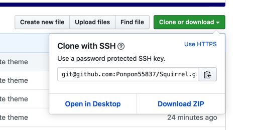
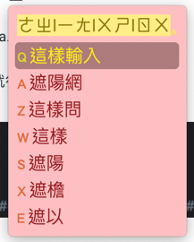
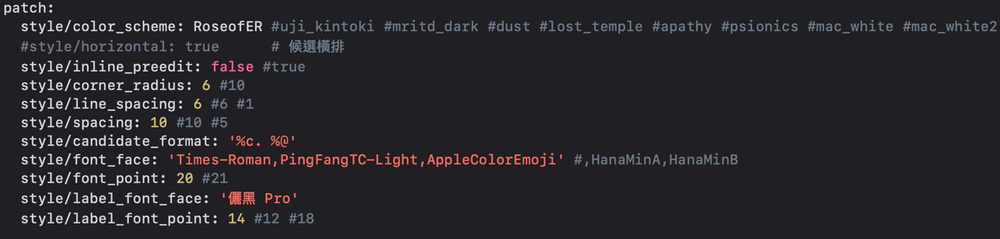
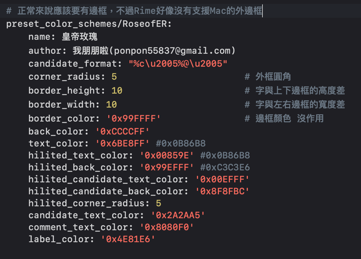
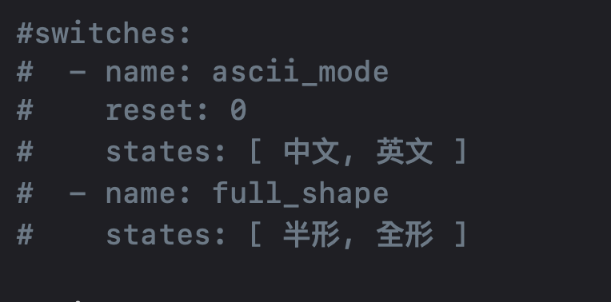
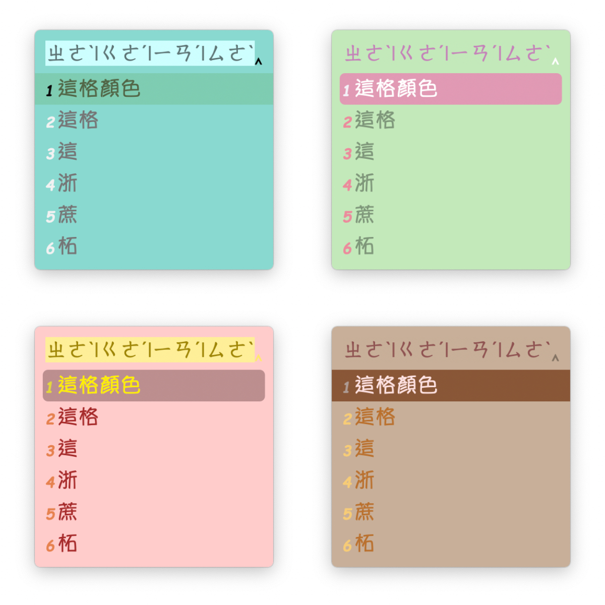

# Mac鼠鬚管洋蔥純注音安裝跟編輯

#### 本文所使用的輸入法由[**oniondelta**](https://github.com/oniondelta)**所製作洋蔥純注音與**[**lotem**](https://github.com/lotem)**製作的鼠鬚管框架**[**squirrel**](https://github.com/rime/squirrel)**修改而來**

**在此感謝洋蔥大大與鼠鬚管作者佛振等人的付出與貢獻**

## How to use

### Install

到Rime的官網下載0.14版鼠鬚管

[https://rime.im/download/](https://rime.im/download/)

筆者個人建議使用homebrew下載，速度比較快

下載完畢之後，請使用spotlight搜尋Squirrel，點擊app進行安裝

安裝完之後，請到系統偏好設定/鍵盤/輸入方式，確認有沒有安裝成功

### Recover

安裝完畢之後，請點擊下面的連結



下載整份ZIP檔

下載完後解壓縮，複製全部的檔案內容

點開Finder，使用前往資料夾 /User/你的使用者/Library/Rime

亦或是點擊右上角鼠鬚管圖示，選擇用戶設定可以快速到達Rime資料夾

到了Rime資料夾刪除全部內容，貼上剛剛複製的檔案

貼上複製的檔案後，點擊右上角輸入法的鼠鬚管圖示，點擊重新部署

這樣輸入時就會有樣式了，而且是使用不用按照注音順序的輸入方式

​如果要修改顯示的候選詞數量，請到Rime/bopomo\_onion.schema.yaml這個檔案

搜尋menu，這裡可以修改候選詞的數量，更改page\_size的數字就行，目前預設候選詞快速鍵爲QAZWSXEDC，如果要設定超過9個候選詞，麻煩在自己增加候選詞快速鍵。

另外這邊提醒要用按鍵選擇文字麻煩按住ctrl鍵+你要選的字的快速鍵

如果要修改外觀，請到Rime/squirrel.custom.yaml這個檔案修改

預設是皇帝玫瑰，也就是RoseofER這個樣式，我做的

裡面有很多樣式可以選，修改style/color\_scheme： 這後面你自己選要用的樣式

這些樣式細節也可以調整，就在下面自己慢慢調

不過這邊有一個小問題，那就是鼠鬚管貌似不支援Mac可用的外邊框也就是windows的外邊框設定在Mac上是沒作用的，所以不論邊框顏色的怎設定它都不會顯示，但是border\_heigh跟border\_width是有作用的，這點我找了好多篇squirrel的提問也沒找到答案，如果後來我有看到解法再來更新。

#### 最後，每次修改完，都要重新部署，不然會沒改變喔。

### Use

再來就是輸入法的切換了，切換不同輸入法請按下 ctrl + \` 或是 F4 進行輸入選擇

中英文與大小寫的切換與原生的Mac輸入法不同

中文切換英文小寫，請按下shift

中文切換英文大寫，請按下caps lock

這邊要特別說的原本的 '、' 是按下 '  ' ，

但是在鼠鬚管洋蔥注音輸入方式是按下 ' = ' + ' ~ ' 或是 shift + ' ’ '

另外，常用的符號可以使用shift + 符號鍵來使用，例如 shift + ' ; ' =&gt; '：'

\(感謝[**oniondelta**](https://github.com/oniondelta) **大大的提醒**\)

鼠鬚管會自動記憶常用詞彙，所以有常用的字多打幾次就行了

另外，選字不止可以使用方向鍵的下，也可以用左右鍵來切換，只要先按下 下鍵 + 左右鍵即可

特殊符號可以使用 ' = ' + 其他按鍵一起使用，至於有什麼符號就自己慢慢嘗試，這邊不一一說明

如果有沒有說明清楚的地方，請大家參考[**oniondelta**](https://github.com/oniondelta)**大的文章**



### 同步用戶資料

如果想在不同電腦上都使用同樣的用戶資料詞典

#### 請打開Rime/**installation.yaml**

將最下面的sync\_dir的\#去掉，並輸入你要使用的資料夾位置。

完畢後，請點開右上角鼠鬚管符號，點擊同步用戶資料。

這時候在你設定好的資料夾就會出現你的詞典了。

我個人是把這個資料夾使用google drive同步到雲端這樣另一臺電腦就可以也使用google drive同步了。

// 20200512 update

原先切換不同輸入法時，會出現半形/全形的選項，但是我覺得這樣切換起來速度很慢。

現在將切換時的選項修改，如下圖

因為其它輸入選項其實我平常很少使用到，所以如果有需要使用的人，麻煩到Rime資料夾底下

尋找到allbpm.schema.yaml、bopomo\_onion.schema.yaml這兩個檔案

打開之後將switches的部分前面的\#符號去掉，如下圖

//  20200525 新增我做的幾個我比較喜歡的樣式，這邊直接附上圖片

左上：Tiffany，左下：RoseofER，右上：TripleColorDumpling，右下：HouseDesign

請自行審視需求進行修改，祝大家使用愉快。

**──────────────────────────────────────────────**

#### **It's** not for commercial use

#### 本內容僅作為一般公開使用，非商業使用，請勿進行商業行爲。

