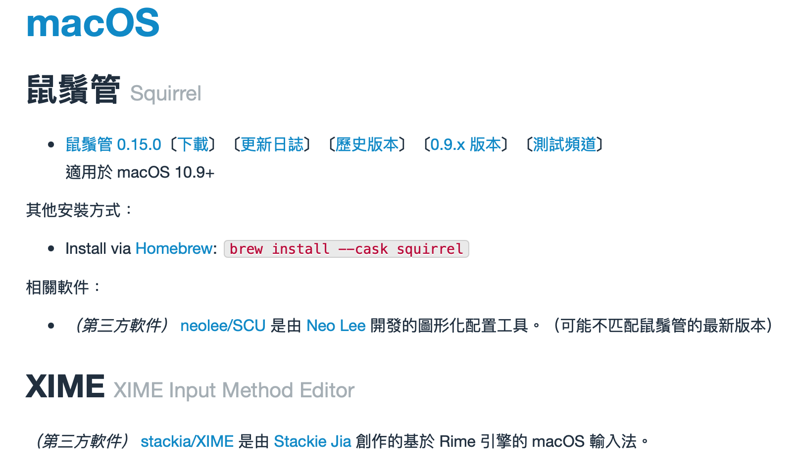
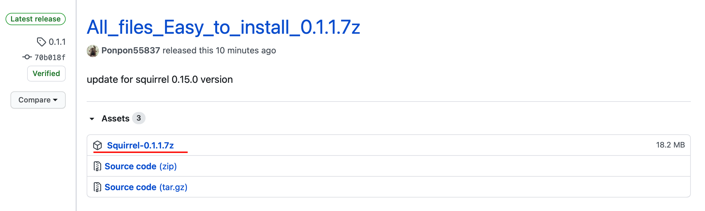
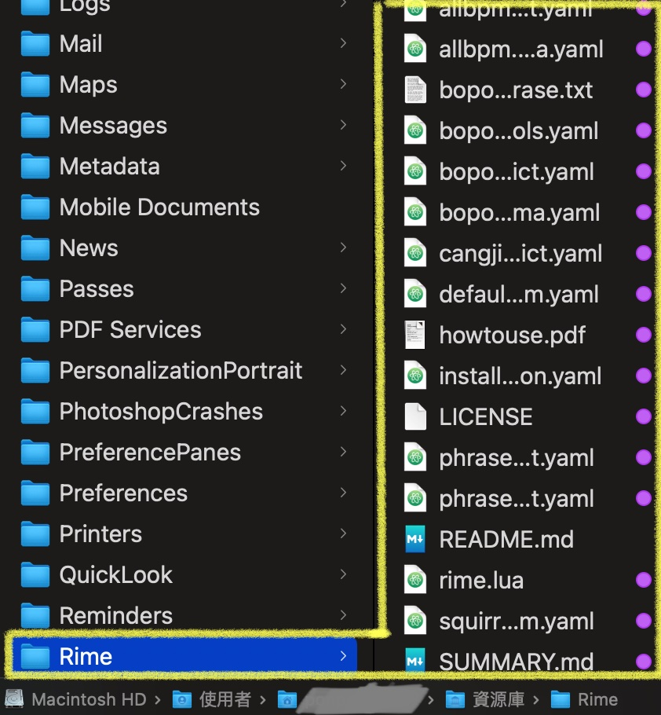
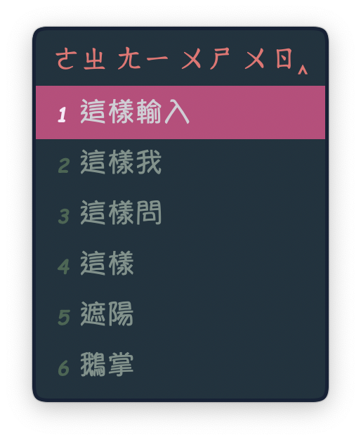
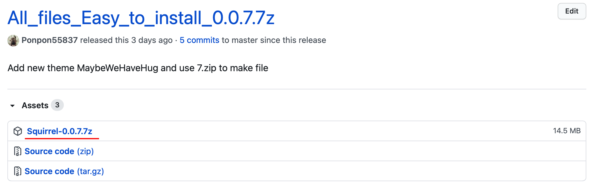
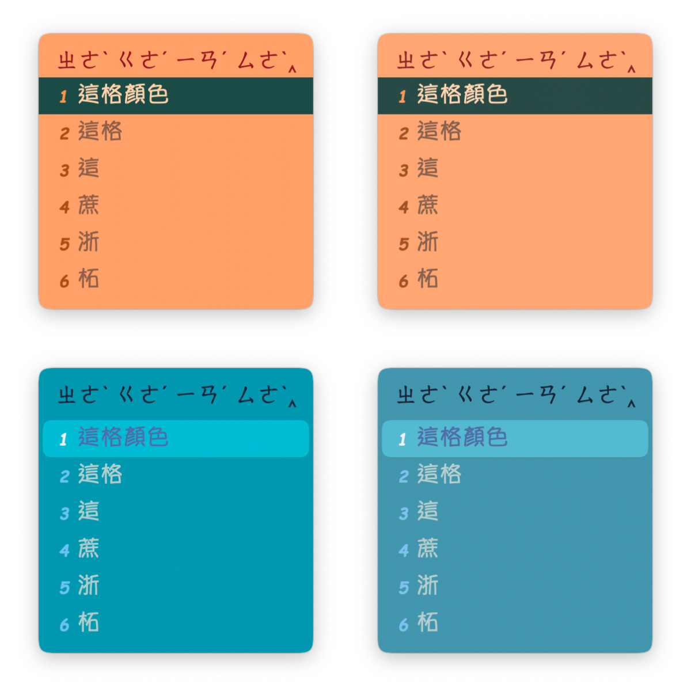
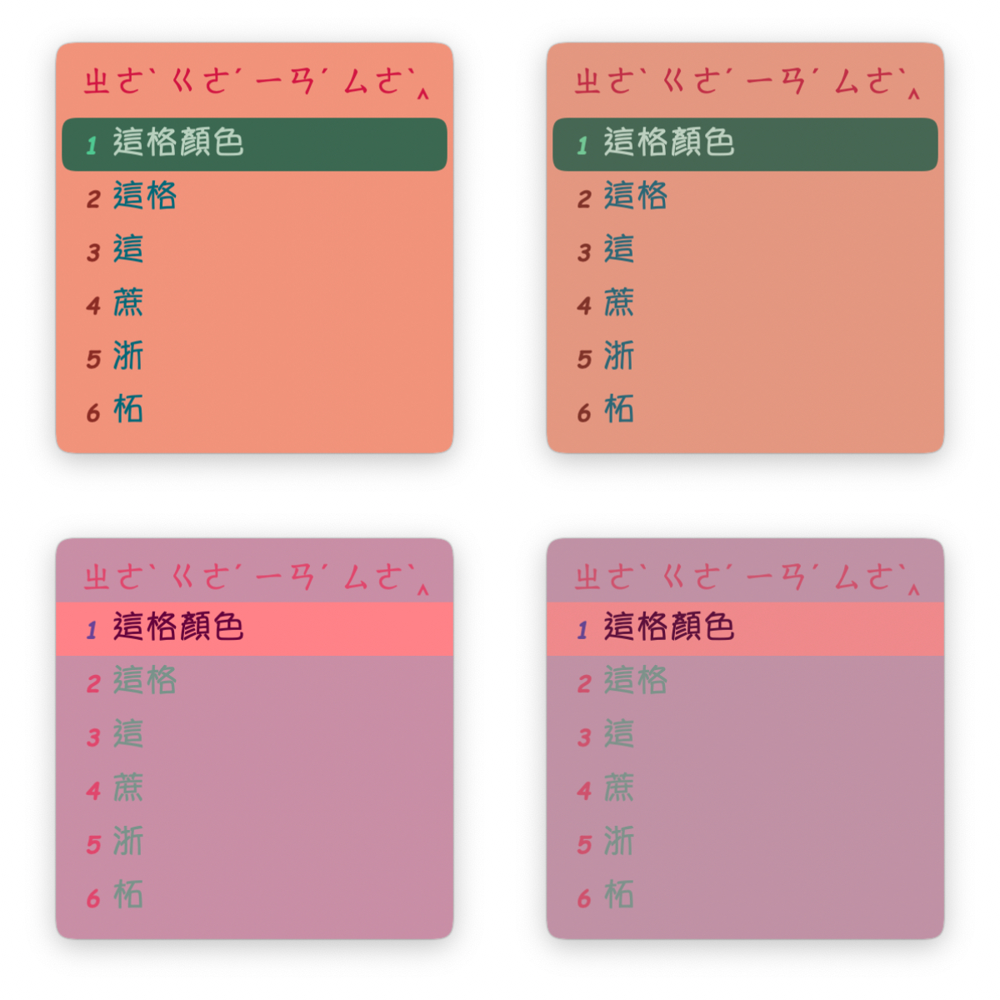
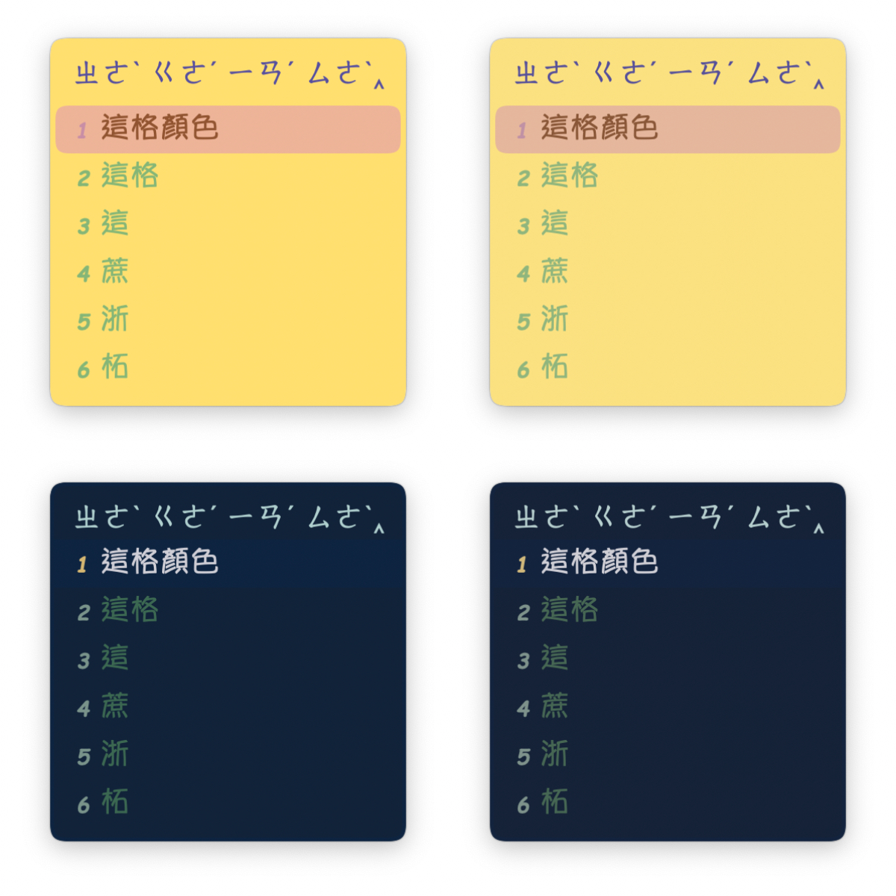
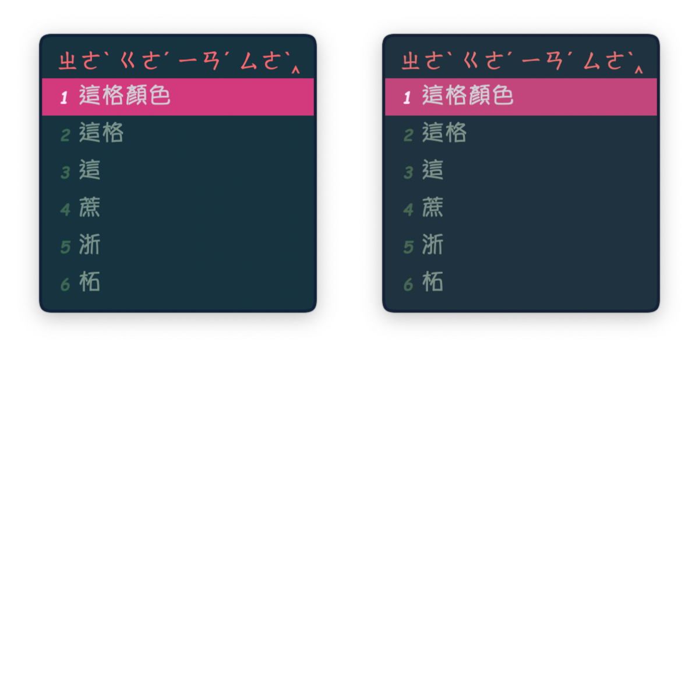

# Mac鼠鬚管洋蔥純注音安裝跟編輯

本文所使用的輸入法由[**oniondelta**](https://github.com/oniondelta)**所製作洋蔥純注音與**[**lotem**](https://github.com/lotem)**製作的鼠鬚管框架**[**squirrel**](https://github.com/rime/squirrel)**修改而來**

**在此感謝洋蔥大大與鼠鬚管作者佛振等人的付出與貢獻**

## How to use

### Good to Read

[https://app.gitbook.com/@ponpon55837/s/squirrel/~/drafts/-MSKqA-eCNg\_HbP\_EK5M/](https://app.gitbook.com/@ponpon55837/s/squirrel/~/drafts/-MSKqA-eCNg_HbP_EK5M/)

### Install

到Rime的官網下載**0.15.0**版鼠鬚管

[https://rime.im/download/](https://rime.im/download/)



筆者個人建議使用**homebrew**下載，速度比較快

下載完畢之後，請使用**spotlight**搜尋**Squirrel**，點擊app進行安裝


安裝完之後，請到系統偏好設定/鍵盤/輸入方式，確認有沒有安裝成功


### Cover files

安裝完畢之後，請點擊下面的連結

[https://github.com/Ponpon55837/Squirrel/releases](https://github.com/Ponpon55837/Squirrel/releases)

下載整份壓縮檔



下載完後解壓縮，複製全部的檔案內容

點開Finder，使用前往資料夾 /User/你的使用者/Library/Rime

亦或是點擊右上角鼠鬚管圖示，選擇用戶設定可以快速到達Rime資料夾


到了Rime資料夾刪除全部內容，貼上剛剛複製的檔案



貼上複製的檔案後，點擊右上角輸入法的鼠鬚管圖示，點擊重新部署


這樣輸入時就會有樣式了，而且是使用不用按照注音順序的輸入方式



​如果要修改顯示的候選詞數量，請到Rime/bopomo\_onion.schema.yaml這個檔案

搜尋menu，這裡可以修改候選詞的數量，更改page\_size的數字就行，目前預設候選詞快速鍵爲QAZWSXEDC，如果要設定超過9個候選詞，麻煩在自己增加候選詞快速鍵。

不過，我個人會建議使用數字123456789，因為這樣在使用ctrl選字時，比較不會出現問題，在一部分app中輸入好像沒辦法使用ctrl+字母會跳掉，我個人是改成使用數字。

```text
menu:
  # 候選字快速鍵
  alternative_select_keys: "QAZWSXEDC
  # 候選字顯示數量
  page_size: 7
```

另外這邊提醒要用按鍵選擇文字麻煩按住ctrl鍵+你要選的字的快速鍵

如果要修改外觀，請到Rime/squirrel.custom.yaml這個檔案修改

**// 20200703 update 刪去在每個scheme中的candidate\_format**

**// 使用style/candidate\_format來帶入每一個scheme中**

**// 這邊使用的是C/C++的空格編碼來書寫**

**// %c是數字或英文標籤  %@是文字選項**

**// "前方間距%c標籤與文字選項間距%@文字選項後方間距"**

```text
patch:
  style/color_scheme: HappySea 
  // 這邊都是可選用的外觀主題
  #MaybeWeHaveHug #DarkMode #GoodEatMango #BigSurDesert #BigSurBeach #AllBlue 
  #OrangeSugar #BigRice #YoungBlood #EastSidePurple #HappySea #Senbe #Sunset 
  #HouseDesign #RoseofER #TriColorDumpling #Tiffany #McDonald #Lakers
  
  # 候選橫排
  #style/horizontal: true  
  
  # 是否使用直式顯示    
  style/inline_preedit: false #true
  
  # 文字行高
  style/line_spacing: 2 #6 #1
  
  # 文字間距
  style/spacing: 2 #10 #5
  
  # 文字字體 字體可以查看Mac的FontBook，你電腦裡有的字體正常都能支援
  style/font_face: 'Times-Roman,YuppyTC-Regular,AppleColorEmoji' #Times-Roman,HanaMinA,HanaMinB  #Times-Roman,PingFangTC-Light,AppleColorEmoji # YuppyTC-Regular
  
  # 字體大小
  style/font_point: 20 #21
  
  # 數字標籤字體 字體可以查看Mac的FontBook，你電腦裡有的字體正常都能支援
  style/label_font_face: 'ComicSansMS-BoldItalic' # DFEr-W4-WIN-BF # 儷黑 Pro # ComicSansMS-BoldItalic
  
  # 標籤字體大小
  style/label_font_point: 14 #14 #12 #18 #20
  
  # 前方標籤位置與後面選字的距離
  # "標籤與前方間距%c標籤與選字間距%@選字與後方間距" 像是這樣
  # \2002 是en space的寬度 \u2004是1/3 em \u2005 是1/4 em \u2006 是1/6 em \u2007 是圖形空間的寬度 \u2008 是標點符號的寬度
  style/candidate_format: "\u2004%c\u2002%@\u2004"
  
  # 外框圓角
  style/corner_radius: 9
  
  # 字與上下邊框的高度差                      
  style/border_height: 5
  
  # 字與左右邊框的寬度差                       
  style/border_width: 5
  
  # 基線調整                      
  style/base_offset: -3                        
```

**// 20210210** 因應鼠鬚管0.15.0版本調整line\_spacing與spacing大小以適應輸入框的改變。

```text
# 文字行高
style/line_spacing: 2 #6 #1
# 文字間距
style/spacing: 2 #10 #5
```

// 20210210 鼠鬚管0.15.0版本新增了base\_offset基線設定參數，實際上用起來就是調整候選文字的上下對齊。

```text
# 基線調整                      
style/base_offset: -3 
```

裡面有很多樣式可以選，修改style/color\_scheme： 這後面你自己選要用的樣式

這些樣式細節也可以調整，就在下面自己慢慢調

```text
preset_color_schemes/RoseofER:
      name: 皇帝玫瑰
      author: 我朋朋啦
      # 使用p色域
      color_space: display_p3
      
      # 邊框顏色       
      border_color: '0x9CB6E5'
      
      # 背景顏色
      back_color: '0xCCCCFF'
      
      # 文字顏色
      text_color: '0x6BE8FF' #0x0B86B8
      
      # 上方拼音或是注音位置背景的底部顏色
      preedit_back_color: '0x5AB0F3'
      
      # 上方拼音或是注音字體顏色
      hilited_text_color: '0x00859E' #0x0B86B8
      
      # 上方拼音或是注音背景顏色
      hilited_back_color: '0xCCCCFF' #0xC3C3E6 #0x99EFFF
      
      # 選中的候選字體顏色
      hilited_candidate_text_color: '0x00EFFF'
      
      # 選中的候選背景顏色
      hilited_candidate_back_color: '0x8F8FBC'
      
      # 選中的候選字框框圓角
      hilited_corner_radius: 7
      
      # 選中的候選背景顏色
      hilited_candidate_back_color: '0x724A5C'
      
      # 選中的候選數字或是英文標籤顏色  
      hilited_candidate_label_color: '0x416AF4' 
      
      # 候選背景顏色
      candidate_text_color: '0x2A2AA5'
      
      #切換中英文文字顏色
      comment_text_color: '0x8080F0'
      
      # 標籤顏色
      label_color: '0x4E81E6'
```

**// 20201117** 有些主題對於候選文字框是填滿的狀態，只要修改hilited corner radius_的大小就能調整了。_ 

```text
preset_color_schemes/Tiffany:
    name: Tiffany
    author: 我朋朋啦
    color_space: display_p3                # 使用p3廣色域顯色
    border_color: '0xFDF8D3'               # 邊框顏色
    #hilited_corner_radius: 5
```

**// 20210208** 這裡說明一下外邊框設計上的問題，如果你很不喜歡外邊框，有兩種解決方式

1. 直接在border\_height border_\__width直接前面加上\# 註記掉程式

```text
style/border_height: 5                       # 字與上下邊框的高度差
style/border_width: 5                        # 字與左右邊框的寬度差
```

   2.  在你選用的那個樣式當中找到border\_color，在前面加上\# 註記掉程式

```text
border_color: '0x9CB6E5'               # 邊框顏色
```

**// 20210208** 

在0.15版鼠鬚管當中已經支援外邊框，不過與原本0.14版樣式上最大的差異在於左右兩側到中間文字間的距離改變了，看起來會覺得中間變胖了，可能需要一點時間調整或適應。

**// 20210209** 如果想使用0.14.0版的鼠鬚管，麻煩下載安裝0.0.7.7z的安裝檔，因為樣式調整上.015.0版與

0.14.0設計上不同，不能直接沿用，當然如果願意自己手動修改那就沒問題。



### **Skin**

**// 20210210** 由於0.15.0版本鼠鬚管增加了p3廣色域對於顏色上顯色的差異，我設計的主題基本上除了Senbe這個主題以外都是預設開啟使用p3顯色的。

如果想要使用非p3顏色的主題，麻煩關閉主題皮膚當中的color\_space。

```text
color_space: display_p3                # 使用p3廣色域顯色
```

**以下的圖片左側都是使用p3顯色，右側則無。**

上：Tiffany，下：TripleColorDumpling


上：RoseofER，下：HouseDesign


上：Sunset，下：Senbe


上：HappySea，下：EastSidePurple


上：YoungBlood，下：BigRice


上：OrangeSugar，下：AllBlue



上：BigSurBeach，下：BigSurDesert



上：GoodEatMango，下：DarkMode



MaybeWeHaveHug



#### 最後，每次修改完，都要重新部署，不然會沒改變喔。

### Use

再來就是輸入法的切換了，切換不同輸入法請按下 ctrl + \` 或是 F4 進行輸入選擇


**// 20210205 update**

**// 20200607 fix problem**

原先在bopomo\_onion.schema.yaml檔案中我關閉了switches功能

但是後來更新了，下方四隻檔案後出現bug

bopomo\_onion\_phrase.txt

bopomo\_onion\_symbols.yaml

bopomo\_onion.extended.dict.yaml

bopomo\_onion.schema.yaml

問題就出在更新了[**oniondelta**](https://github.com/oniondelta) 20200530檔案後，需要到bopomo\_onion.schema.yaml

switches中打開原本被關閉的reset: 0要去掉前面的\#

否則會出現無法變更成繁體的輸入方式

如果你已經修改完成，且以後不需要使用簡體，也確定目前使用的是繁體時，再到bopomo\_onion.schema.yaml中關閉switches才不會出現問題，我因爲有切換成簡體但是忘記切回繁體就把bopomo\_onion.schema.yaml中的switches都關閉了，才出現繁體簡體混合不能切換的問題，請使用者留心使用。


中英文與大小寫的切換與原生的Mac輸入法不同

中文切換英文小寫，請按下shift

中文切換英文大寫，請按下caps lock

這邊要特別說的原本的 '、' 

在鼠鬚管洋蔥注音輸入方式是按下 ' = ' + ' ~ ' 或是 shift + ' ’ '

**// 20200717 update** 

現在除了shift + ' ’ '，也可以直接按下' ’ '會出現有頓號跟其它選項可以用

另外，常用的符號可以使用shift + 符號鍵來使用，例如 shift + ' ; ' =&gt; '：'

\(感謝[**oniondelta**](https://github.com/oniondelta) **大大的提醒**\)

鼠鬚管會自動記憶常用詞彙，所以有常用的字多打幾次就行了

另外，選字不止可以使用方向鍵的下，也可以用左右鍵來切換，只要先按下 下鍵 + 左右鍵即可

特殊符號可以使用 ' = ' + 其他按鍵一起使用，至於有什麼符號就自己慢慢嘗試，這邊不一一說明

如果有沒有說明清楚的地方，請大家參考[**oniondelta**](https://github.com/oniondelta)大的文章

[注音設定檔連結](https://deltazone.pixnet.net/blog/post/264319309-鼠鬚管注音方案---符合一般注音使用者習慣設)

**// 20201129 update**

在下載下來的檔案當中還有一份howtouse.pdf，裡面有我寫的部分的說明，可能無法完全的說清楚，不過在使用上應當大致上沒問題。


### Sync Data

如果想在不同電腦上都使用同樣的用戶資料詞典

#### 請打開Rime/**installation.yaml**


**注意 這邊的installation\_id在安裝鼠鬚管時，電腦會自動生成，要多台電腦同步的話，請自行使用其中一個installation\_id。**



將最下面的sync\_dir的\#去掉，並輸入你要使用的資料夾位置。

完畢後，請點開右上角鼠鬚管符號，點擊同步用戶資料。


這時候在你設定好的資料夾就會出現你的詞典了。

我個人是把這個資料夾使用google drive同步到雲端這樣另一臺電腦就可以也使用google drive同步了。

請自行審視需求進行修改，祝大家使用愉快。

### Uninstall

如果安裝時是使用Homebrew進行安裝，那麼移除的方式就很簡單了，請在終端機輸入

```text
brew uninstall --cask squirrel
```

至於我明明很喜歡鼠鬚管為什麼還要提供移除方式的原因是，有可能你在安裝新版本鼠鬚管更新時，不知道為啥會發生升級失敗的情況，導致整個輸入法掛點，請直接移除鼠鬚管，然後重新使用Homebrew重新安裝一次鼠鬚管。

**──────────────────────────────────────────────**

### **版權宣告**

#### **基於尊重**[**lotem**](https://github.com/lotem)**製作的鼠鬚管框架**[**squirrel**](https://github.com/rime/squirrel)**，使用與**[**squirrel**](https://github.com/rime/squirrel)**相同的GNU GPL v3 license。**

#### **以自由軟體開源精神所設定的license，如果有任何使用上的錯誤煩請在**[**我的github上的issue**](https://github.com/Ponpon55837/Squirrel/issues)**告知我，感謝。**

#### **It's** not for commercial use

#### 本內容僅作為一般公開使用，非商業使用，請勿進行商業行爲。

**──────────────────────────────────────────────**

**如果上面描述的文字不夠準確，可以參考底下的心智圖，我有大致上將會用到的內容描述上去。**


