# Mac鼠鬚管洋蔥純注音安裝跟編輯

#### 本文所使用的輸入法由[**oniondelta**](https://github.com/oniondelta)**所製作洋蔥純注音與**[**lotem**](https://github.com/lotem)**製作的鼠鬚管框架**[**squirrel**](https://github.com/rime/squirrel)**修改而來**

**在此感謝洋蔥大大與鼠鬚管作者佛振等人的付出與貢獻**

## How to use

### Install

到Rime的官網下載0.14版鼠鬚管

[https://rime.im/download/](https://rime.im/download/)

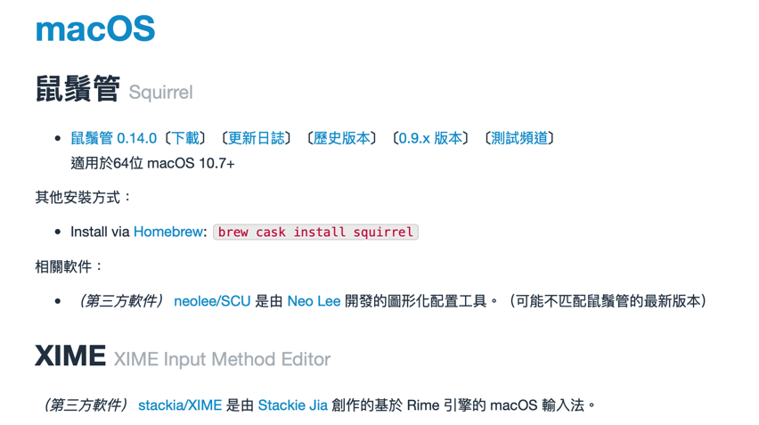

筆者個人建議使用homebrew下載，速度比較快

下載完畢之後，請使用spotlight搜尋Squirrel，點擊app進行安裝

安裝完之後，請到系統偏好設定/鍵盤/輸入方式，確認有沒有安裝成功

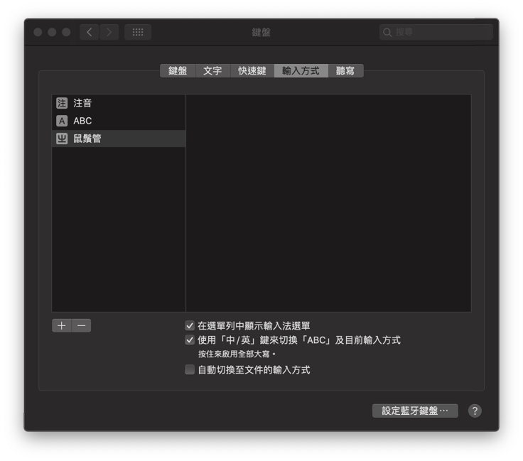

### Recover

安裝完畢之後，請點擊下面的連結

[https://github.com/Ponpon55837/Squirrel/releases](https://github.com/Ponpon55837/Squirrel/releases/tag/0.0.1)

下載整份ZIP檔

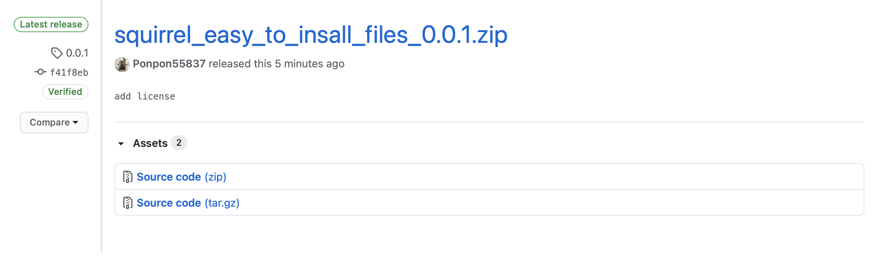

下載完後解壓縮，複製全部的檔案內容

點開Finder，使用前往資料夾 /User/你的使用者/Library/Rime

亦或是點擊右上角鼠鬚管圖示，選擇用戶設定可以快速到達Rime資料夾

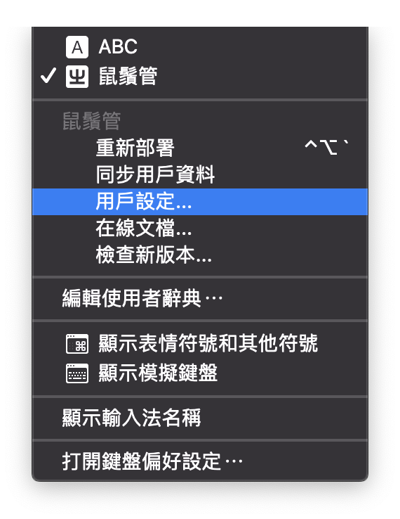

到了Rime資料夾刪除全部內容，貼上剛剛複製的檔案

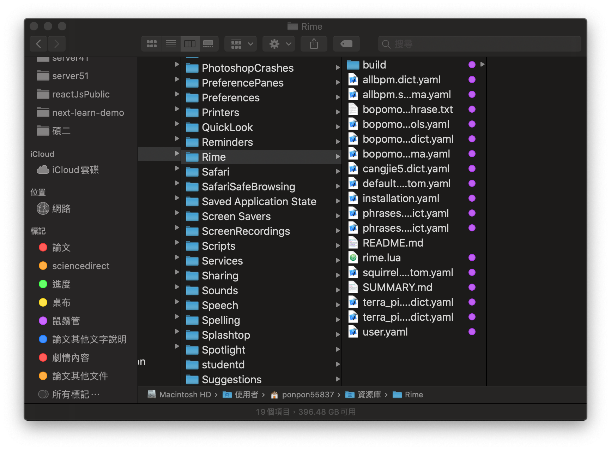

貼上複製的檔案後，點擊右上角輸入法的鼠鬚管圖示，點擊重新部署

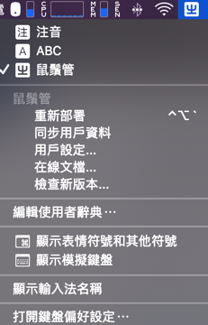

這樣輸入時就會有樣式了，而且是使用不用按照注音順序的輸入方式

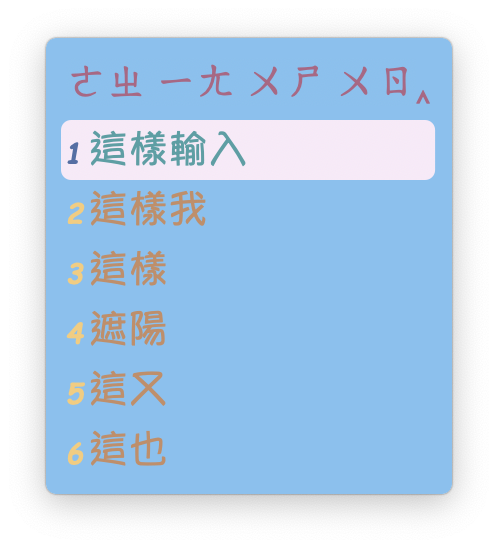

​如果要修改顯示的候選詞數量，請到Rime/bopomo\_onion.schema.yaml這個檔案

搜尋menu，這裡可以修改候選詞的數量，更改page\_size的數字就行，目前預設候選詞快速鍵爲QAZWSXEDC，如果要設定超過9個候選詞，麻煩在自己增加候選詞快速鍵。

不過，我個人會建議使用數字123456789，因為這樣在使用ctrl選字時，比較不會出現問題，在一部分app中輸入好像沒辦法使用ctrl+字母會跳掉，我個人是改成使用數字。

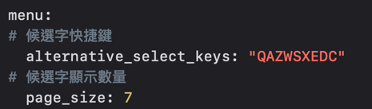

另外這邊提醒要用按鍵選擇文字麻煩按住ctrl鍵+你要選的字的快速鍵

如果要修改外觀，請到Rime/squirrel.custom.yaml這個檔案修改

// 20200703 update 刪去在每個scheme中的candidate\_format

// 使用style/candidate\_format來帶入每一個scheme中

// 這邊使用的是C/C++的空格編碼來書寫

// %c是數字或英文標籤  %@是文字選項

// "前方間距%c標籤與文字選項間距%@文字選項後方間距"

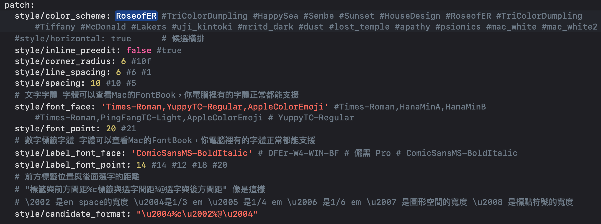

裡面有很多樣式可以選，修改style/color\_scheme： 這後面你自己選要用的樣式

這些樣式細節也可以調整，就在下面自己慢慢調

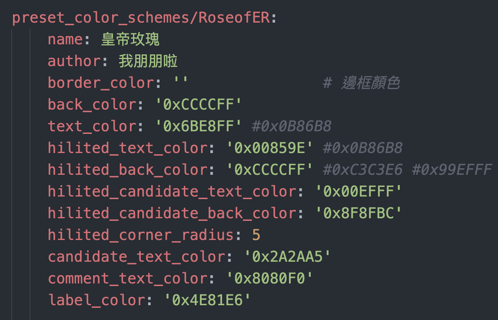

// 20201117 有些主題對於候選文字框是填滿的狀態，只要修改hilited corner radius_的大小就能調整了。_ 

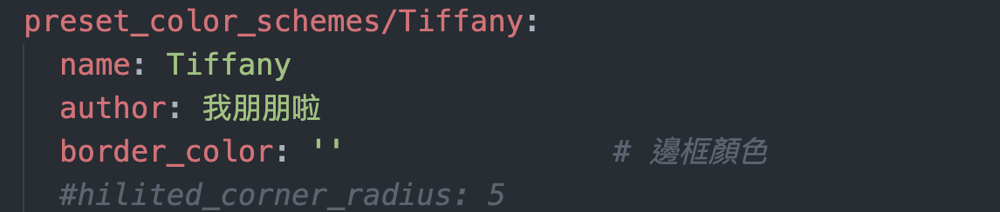

// 20201117 從對岸知乎上面找到一些鼠鬚管的contributer說明，在之後的0.15版鼠鬚管就會支援外邊框了。

不過這邊有一個小問題，那就是鼠鬚管貌似不支援Mac可用的外邊框也就是windows的外邊框設定在Mac上是沒作用的，所以不論邊框顏色的怎設定它都不會顯示，但是border\_heigh跟border\_width是有作用的，這點我找了好多篇squirrel的提問也沒找到答案，如果後來我有看到解法再來更新。

// 20200526update 由於鼠鬚管不像是windows小狼毫那樣有外框，本身鼠鬚管就沒這個設定，所以外框設定是無效的。

// 20200525 新增我做的幾個我比較喜歡的樣式，這邊直接附上圖片

左上：Tiffany，右上：TripleColorDumpling

左下：RoseofER，右下：HouseDesign

左上：Sunset，右上：Senbe

左下：HappySea，右下：EastSidePurple

左上：YoungBlood，右上：BigRice

左下：OrangeSugar，右下：AllBlue

左上：BigSurBeach

#### 最後，每次修改完，都要重新部署，不然會沒改變喔。

### Use

再來就是輸入法的切換了，切換不同輸入法請按下 ctrl + \` 或是 F4 進行輸入選擇

// 20200512 update

// 20200607 fix problem

原先在bopomo\_onion.schema.yaml檔案中我關閉了switches功能

但是後來更新了，下方四隻檔案後出現bug

bopomo\_onion\_phrase.txt

bopomo\_onion\_symbols.yaml

bopomo\_onion.extended.dict.yaml

bopomo\_onion.schema.yaml

問題就出在更新了[**oniondelta**](https://github.com/oniondelta) 20200530檔案後，需要到bopomo\_onion.schema.yaml

switches中打開原本被關閉的reset: 0要去掉前面的\#

否則會出現無法變更成繁體的輸入方式

如果你已經修改完成，且以後不需要使用簡體，也確定目前使用的是繁體時，再到bopomo\_onion.schema.yaml中關閉switches才不會出現問題，我因爲有切換成簡體但是忘記切回繁體就把bopomo\_onion.schema.yaml中的switches都關閉了，才出現繁體簡體混合不能切換的問題，請使用者留心使用。

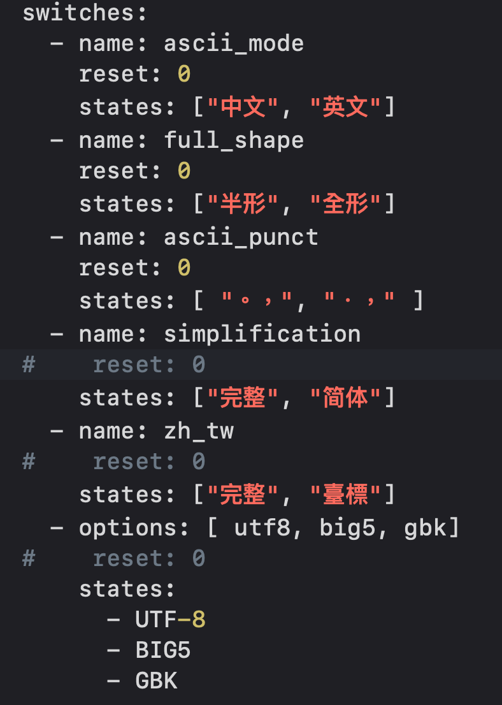

中英文與大小寫的切換與原生的Mac輸入法不同

中文切換英文小寫，請按下shift

中文切換英文大寫，請按下caps lock

這邊要特別說的原本的 '、' 

在鼠鬚管洋蔥注音輸入方式是按下 ' = ' + ' ~ ' 或是 shift + ' ’ '

// 0717 update 現在除了shift + ' ’ '，也可以直接按下' ’ '會出現有頓號跟其它選項可以用

另外，常用的符號可以使用shift + 符號鍵來使用，例如 shift + ' ; ' =&gt; '：'

\(感謝[**oniondelta**](https://github.com/oniondelta) **大大的提醒**\)

鼠鬚管會自動記憶常用詞彙，所以有常用的字多打幾次就行了

另外，選字不止可以使用方向鍵的下，也可以用左右鍵來切換，只要先按下 下鍵 + 左右鍵即可

特殊符號可以使用 ' = ' + 其他按鍵一起使用，至於有什麼符號就自己慢慢嘗試，這邊不一一說明

如果有沒有說明清楚的地方，請大家參考[**oniondelta**](https://github.com/oniondelta)**大的文章**



### 同步用戶資料

如果想在不同電腦上都使用同樣的用戶資料詞典

#### 請打開Rime/**installation.yaml**


**注意 這邊的installation\_id在安裝鼠鬚管時，電腦會自動生成，要多台電腦同步的話，請自行使用其中一個installation\_id。**


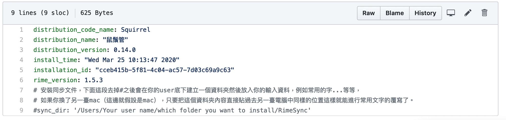

將最下面的sync\_dir的\#去掉，並輸入你要使用的資料夾位置。

完畢後，請點開右上角鼠鬚管符號，點擊同步用戶資料。

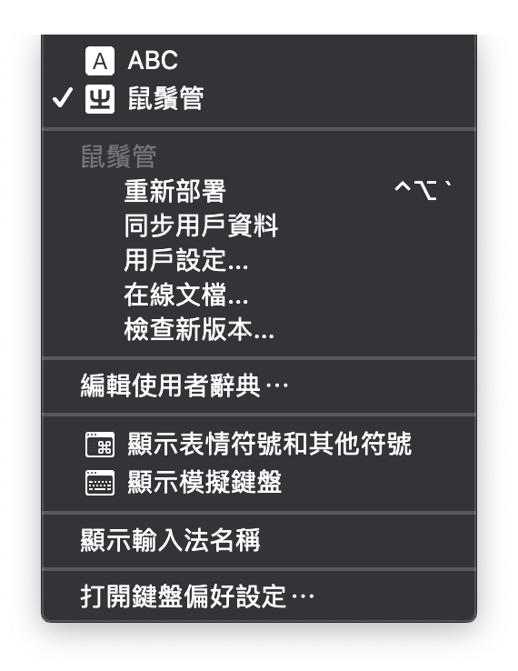

這時候在你設定好的資料夾就會出現你的詞典了。

我個人是把這個資料夾使用google drive同步到雲端這樣另一臺電腦就可以也使用google drive同步了。

請自行審視需求進行修改，祝大家使用愉快。

**──────────────────────────────────────────────**

#### **基於尊重**[**lotem**](https://github.com/lotem)**製作的鼠鬚管框架**[**squirrel**](https://github.com/rime/squirrel)**，使用與**[**squirrel**](https://github.com/rime/squirrel)**相同的GNU GPL v3 license。**

#### **以自由軟體開源精神所設定的license，如果有任何使用上的錯誤凡請在**[**我的github上的issue**](https://github.com/Ponpon55837/Squirrel/issues)**告知我，感謝。**

#### **It's** not for commercial use

#### 本內容僅作為一般公開使用，非商業使用，請勿進行商業行爲。

**──────────────────────────────────────────────**

**如果上面描述的文字不夠準確，可以參考底下的心智圖，我有大致上將會用到的內容描述上去。**

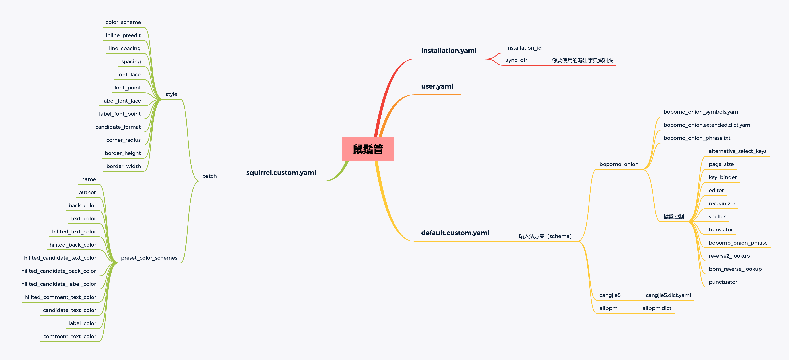

