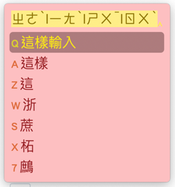
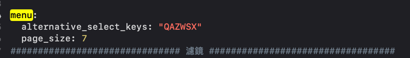
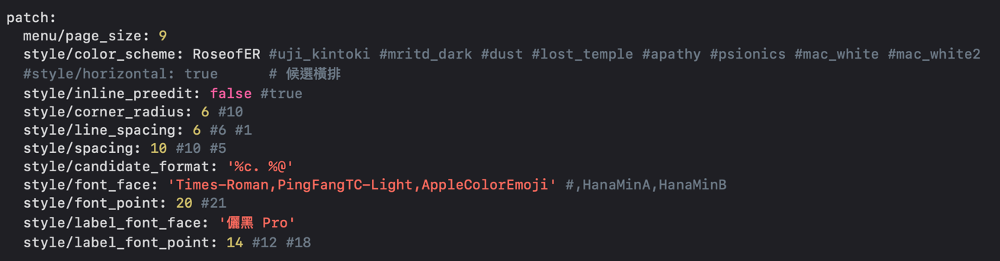

# Mac鼠鬚管洋蔥純注音安裝跟編輯

## How to use 

### Install

到Rime的官網下載0.14版鼠鬚管

[https://rime.im/download/](https://rime.im/download/)

筆者個人建議使用homebrew下載，速度比較快

下載完畢之後，請使用spotlight搜尋Squirrel，點擊app進行安裝

### Recover

安裝完畢之後，請點擊下面的連結



下載整份ZIP檔

下載完後解壓縮，複製全部的內容

點開Finder，使用前往資料夾 /User/你的使用者/Library/Rime

到了Rime資料刪除全部內容，貼上剛剛複製的檔案

點擊輸入法的鼠鬚管圖示，點擊重新部署

這樣輸入時就會有樣式了，而且是使用不用按照注音順序的輸入方式

​如果要修改顯示的候選詞數量，請到Rime/bopomo\_onion.schema.yaml這個檔案

搜尋meun，這裡可以修改候選詞的數量

如果要修改外觀，請到Rime/squirrel.custom.yaml這個檔案修改

預設是皇帝玫瑰，也就是RoseofER這個樣式，我本人做的

裡面有很多樣式可以選，修改style/color\_scheme： 這後面你自己選要用的樣式

這些樣式細節也可以調整，就在下面自己慢慢調

