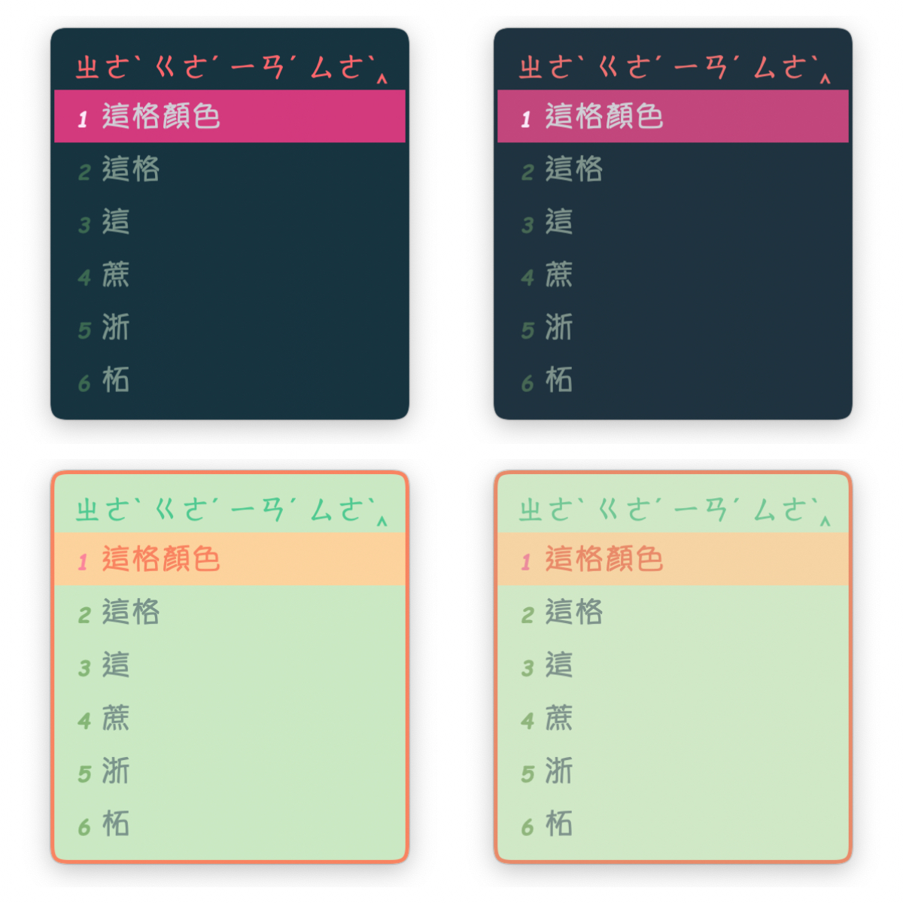
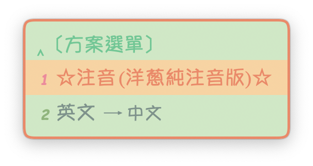
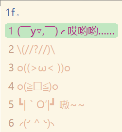

# Mac鼠鬚管洋蔥純注音安裝跟編輯

本文所使用的輸入法由[**oniondelta**](https://github.com/oniondelta)**所製作洋蔥純注音與**[**lotem**](https://github.com/lotem)**製作的鼠鬚管框架**[**squirrel**](https://github.com/rime/squirrel)**修改而來**

**在此感謝洋蔥大大與鼠鬚管作者佛振等人的付出與貢獻**

## How to use

### Good to Read

[https://app.gitbook.com/@ponpon55837/s/squirrel/~/drafts/-MSKqA-eCNg\_HbP\_EK5M/](https://app.gitbook.com/@ponpon55837/s/squirrel/~/drafts/-MSKqA-eCNg_HbP_EK5M/)

### Install

到Rime的官網下載**0.15.0**版鼠鬚管

[https://rime.im/download/](https://rime.im/download/)


筆者個人建議使用**homebrew**下載，速度比較快

1.下載完畢之後，homebrew會自動進行安裝。安裝完畢後。**記得要登出在登入喔。**

2.安裝完之後，請到系統偏好設定/鍵盤/輸入方式，確認有沒有安裝成功。


### Cover files

安裝完畢之後，請點擊下面的連結。

[https://github.com/Ponpon55837/Squirrel/releases](https://github.com/Ponpon55837/Squirrel/releases)

1.下載整份壓縮檔


2.下載完後解壓縮，複製全部的檔案內容

3.點開Finder，使用前往資料夾`/User/你的使用者/Library/Rime`，亦或是點擊右上角鼠鬚管圖示，選擇用戶設定可以快速到達Rime資料夾。


4.到了Rime資料夾刪除全部內容，貼上剛剛複製的檔案。


5.貼上複製的檔案後，點擊右上角輸入法的鼠鬚管圖示，點擊重新部署。


**Finally** 這樣輸入時就會有樣式了，而且是使用不用按照注音順序的輸入方式。


### Custom

​如果要修改顯示的候選詞數量，請到`Rime/bopomo_onion.schema.yaml`這個檔案

搜尋menu，這裡可以修改候選詞的數量，更改`page_size`的數字就行，目前預設候選詞快速鍵爲123456789，如果要設定超過9個候選詞，麻煩在自己增加候選詞快速鍵。

我個人會建議使用數字123456789，因為這樣在使用ctrl選字時，比較不會出現問題，不過如果你希望使用英文字母也可自行更改為QAZWSXEDC，在一部分app中輸入好像沒辦法使用`ctrl+`字母會跳掉，我個人是改成使用數字。

```text
menu:
  # 候選字快速鍵
  alternative_select_keys: "QAZWSXEDC
  # 候選字顯示數量
  page_size: 7
```

另外這邊提醒要用按鍵選擇文字麻煩按住ctrl鍵+你要選的字的快速鍵

如果要修改外觀，請到`Rime/squirrel.custom.yaml`這個檔案修改。

```text
patch:
  style/color_scheme: HappySea 
  // 這邊都是可選用的外觀主題
  #MaybeWeHaveHug #DarkMode #GoodEatMango #BigSurDesert #BigSurBeach #AllBlue 
  #OrangeSugar #BigRice #YoungBlood #EastSidePurple #HappySea #Senbe #Sunset 
  #HouseDesign #RoseofER #TriColorDumpling #Tiffany #McDonald #Lakers
  
  # 候選橫排
  #style/horizontal: true  
  
  # 是否使用直式顯示    
  style/inline_preedit: false #true
  
  # 文字行高
  style/line_spacing: 2 #6 #1
  
  # 文字間距
  style/spacing: 2 #10 #5
  
  # 文字字體 字體可以查看Mac的FontBook，你電腦裡有的字體正常都能支援
  style/font_face: 'Times-Roman,YuppyTC-Regular,AppleColorEmoji' #Times-Roman,HanaMinA,HanaMinB  #Times-Roman,PingFangTC-Light,AppleColorEmoji # YuppyTC-Regular
  
  # 字體大小
  style/font_point: 20 #21
  
  # 數字標籤字體 字體可以查看Mac的FontBook，你電腦裡有的字體正常都能支援
  style/label_font_face: 'ComicSansMS-BoldItalic' # DFEr-W4-WIN-BF # 儷黑 Pro # ComicSansMS-BoldItalic
  
  # 標籤字體大小
  style/label_font_point: 14 #14 #12 #18 #20
  
  # 前方標籤位置與後面選字的距離
  # "標籤與前方間距%c標籤與選字間距%@選字與後方間距" 像是這樣
  # \2002 是en space的寬度 \u2004是1/3 em \u2005 是1/4 em \u2006 是1/6 em \u2007 是圖形空間的寬度 \u2008 是標點符號的寬度
  style/candidate_format: "\u2004%c\u2002%@\u2004"
  
  # 外框圓角
  style/corner_radius: 9
  
  # 字與上下邊框的高度差                      
  style/border_height: 5
  
  # 字與左右邊框的寬度差                       
  style/border_width: 5
  
  # 基線調整                      
  style/base_offset: -3                        
```

**// 20210210** 因應鼠鬚管0.15.0版本調整`line_spacing`與`spacing`大小以適應輸入框的改變。

```text
# 文字行高
style/line_spacing: 2 #6 #1
# 文字間距
style/spacing: 2 #10 #5
```

// 20210210 鼠鬚管0.15.0版本新增了base\_offset基線設定參數，實際上用起來就是調整候選文字的上下對齊。

```text
# 基線調整                      
style/base_offset: -3 
```

裡面有很多樣式可以選，修改`style/color_scheme：` 這後面你自己選要用的樣式

這些樣式細節也可以調整，就在下面自己慢慢調。

```text
preset_color_schemes/RoseofER:
      name: 皇帝玫瑰
      author: 我朋朋啦
      # 使用p色域
      color_space: display_p3
      
      # 邊框顏色       
      border_color: '0x9CB6E5'
      
      # 背景顏色
      back_color: '0xCCCCFF'
      
      # 文字顏色
      text_color: '0x6BE8FF' #0x0B86B8
      
      # 上方拼音或是注音位置背景的底部顏色
      preedit_back_color: '0x5AB0F3'
      
      # 上方拼音或是注音字體顏色
      hilited_text_color: '0x00859E' #0x0B86B8
      
      # 上方拼音或是注音背景顏色
      hilited_back_color: '0xCCCCFF' #0xC3C3E6 #0x99EFFF
      
      # 選中的候選字體顏色
      hilited_candidate_text_color: '0x00EFFF'
      
      # 選中的候選背景顏色
      hilited_candidate_back_color: '0x8F8FBC'
      
      # 選中的候選字框框圓角
      hilited_corner_radius: 7
      
      # 選中的候選背景顏色
      hilited_candidate_back_color: '0x724A5C'
      
      # 選中的候選數字或是英文標籤顏色  
      hilited_candidate_label_color: '0x416AF4' 
      
      # 候選背景顏色
      candidate_text_color: '0x2A2AA5'
      
      #切換中英文文字顏色
      comment_text_color: '0x8080F0'
      
      # 標籤顏色
      label_color: '0x4E81E6'
```

**// 20201117** 有些主題對於候選文字框是填滿的狀態，只要修改`hilited corner radius`_的大小就能調整了。_ 

```text
preset_color_schemes/Tiffany:
    name: Tiffany
    author: 我朋朋啦
    color_space: display_p3                # 使用p3廣色域顯色
    border_color: '0xFDF8D3'               # 邊框顏色
    #hilited_corner_radius: 5
```

**// 20210208** 這裡說明一下外邊框設計上的問題，如果你很不喜歡外邊框，有兩種解決方式

1. 直接在`border_height border_width`直接前面加上\# 註記掉程式

```text
style/border_height: 5                       # 字與上下邊框的高度差
style/border_width: 5                        # 字與左右邊框的寬度差
```

   2.  在你選用的那個樣式當中找到`border_color`，在前面加上\# 註記掉程式

```text
border_color: '0x9CB6E5'               # 邊框顏色
```

**// 20210208** 

在0.15版鼠鬚管當中已經支援外邊框，不過與原本0.14版樣式上最大的差異在於左右兩側到中間文字間的距離改變了，看起來會覺得中間變胖了，可能需要一點時間調整或適應。

**// 20210209** _**如果想使用0.14.0版的鼠鬚管**_，麻煩下載安裝0.0.7.7z的安裝檔，因為樣式調整上.015.0版與

0.14.0設計上不同，不能直接沿用，當然如果願意自己手動修改那就沒問題。


### **Skin**

**// 20210210** 由於0.15.0版本鼠鬚管增加了p3廣色域對於顏色上顯色的差異，我設計的主題基本上除了Senbe這個主題以外都是預設開啟使用p3顯色的。

如果想要使用非p3顏色的主題，麻煩關閉主題皮膚當中的`color_space`。

```text
color_space: display_p3                # 使用p3廣色域顯色
```

**以下的圖片左側都是使用p3顯色，右側則無。**

上：Tiffany，下：TripleColorDumpling


上：RoseofER，下：HouseDesign


上：Sunset，下：Senbe


上：HappySea，下：EastSidePurple


上：YoungBlood，下：BigRice


上：OrangeSugar，下：AllBlue


上：BigSurBeach，下：BigSurDesert


上：GoodEatMango，下：DarkMode


上：MaybeWeHaveHug，下：Grassland



#### 最後，每次修改完，都要重新部署，不然會沒改變喔。

### Use

**// 20210425 update remove switch input method hot key**

筆者認為目前已經關閉大部分切換其它輸入法的需求，所以目前並沒有必須要開啟熱鍵進行切換輸入法的使用目的，且這些熱鍵會佔走一部分功能的使用，所以在新更新中在`default.custom.yaml中`隱藏了。

```text
switcher/fix_schema_list_order: true #固定方案選單順序
  switcher/hotkeys:
    # - Control+grave
    # - Control+Shift+grave
    # - F4
```

如果開啟這項功能的話，請按下ctrl + \` 或是 F4來切換不同輸入法。



**// 20200607 fix problem**

原先在`bopomo_onion.schema.yaml`檔案中我關閉了`switches`功能

但是後來更新了，下方四隻檔案後出現bug

`bopomo_onion_phrase.txt`

`bopomo_onion_symbols.yaml`

`bopomo_onion.extended.dict.yaml`

`bopomo_onion.schema.yaml`

問題就出在更新了[**oniondelta**](https://github.com/oniondelta) 20200530檔案後，需要到`bopomo_onion.schema.yaml`

`switches`中打開原本被關閉的`reset: 0`要去掉前面的\#

否則會出現無法變更成繁體的輸入方式

如果你已經修改完成，且以後不需要使用簡體，也確定目前使用的是繁體時，再到`bopomo_onion.schema.yaml`中關閉`switches`才不會出現問題，我因爲有切換成簡體但是忘記切回繁體就把`bopomo_onion.schema.yaml`中的`switches`都關閉了，才出現繁體簡體混合不能切換的問題，請使用者留心使用。

```text
switches:
  - name: ascii_mode
    reset: 0
    states: ["中文", "英文"]
  # - name: full_shape
  #   reset: 0
  #   states: ["半形", "全形"]
  # - name: ascii_punct
  #   reset: 0
  #   states: ["。，", "．，"]
  # - name: simplification
  #   reset: 0
  #   states: ["原體", "简体"]
  # - options: [ utf8, big5, gbk ]
  #    reset: 0
  #    states:
  #      - UTF-8
  #      - BIG5
  #      - GBK
```

中英文與大小寫的切換與原生的Mac輸入法不同

中文切換英文小寫，請按下`shift`

中文切換英文大寫，請按下`caps lock`

全形/半形標點符號切換，請按下`ctrl + /`

全形/半形空白切換，請按下`ctrl + >`

這邊要特別說的原本的 `'、'` 

在鼠鬚管洋蔥注音輸入方式是按下 `' = ' + ' ~ '` 或是`shift + ' ’ '`

**// 20200717 update** 

現在除了`shift + ' ’ '`，也可以直接按下`' ’ '`會出現有頓號跟其它選項可以用

另外，常用的符號可以使用`shift +` 符號鍵來使用，例如 `shift + ' ; ' => '：'`

\(感謝[**oniondelta**](https://github.com/oniondelta) **大大的提醒**\)

鼠鬚管會自動記憶常用詞彙，所以有常用的字多打幾次就行了

另外，選字不止可以使用方向鍵的下，也可以用左右鍵來切換，只要先按下 下鍵 + 左右鍵即可

特殊符號可以使用 `' = ' +` 其他按鍵一起使用，至於有什麼符號就自己慢慢嘗試，這邊不一一說明

如果有沒有說明清楚的地方，請大家參考[**oniondelta**](https://github.com/oniondelta)大的文章。

**// 20210420 phrase description**

如果打開`Rime`資料夾可以看到有一項`bopomo_onion_phrase`的檔案，打開之後會發現裡面沒有什麼內容，這個檔案是用來附加你使用的快捷鍵用的。

使用者可以自定義自己的快捷鍵，不過要注意不要重複的太多，這樣很難選字。

快捷鍵可以有很多玩法，例如快速輸入網址，或是使用者帳號，地址，電話......等，但是**切忌不要使用快捷鍵來輸入密碼，這樣很不安全**。

```text
用表情的例子來說明，我將下面的表情書寫好後，按下tab鍵，
輸入對應的快捷鍵1f這樣按下中文1f的對應按鍵ㄅㄑ，就會顯示快捷鍵對應的內容
\(//?//)\	1f
```



[注音設定檔連結](https://deltazone.pixnet.net/blog/post/264319309-鼠鬚管注音方案---符合一般注音使用者習慣設)

**// 20201129 update**

在下載下來的檔案當中還有一份howtouse.pdf，裡面有我寫的部分的說明，可能無法完全的說清楚，不過在使用上應當大致上沒問題。


### Sync Data

如果想在不同電腦上都使用同樣的用戶資料詞典

#### 請打開Rime/**installation.yaml**


**注意 這邊的installation\_id在安裝鼠鬚管時，電腦會自動生成，要多台電腦同步的話，請自行使用其中一個installation\_id。**


```text
distribution_code_name: Squirrel
distribution_name: "鼠鬚管"
distribution_version: 0.14.0
install_time: "Wed Mar 25 10:13:47 2020"
# 如果你兩台電腦要使用像是google drvie這種雲端軟體進行同步，麻煩下面的id要相同不然你同步的資料夾會長不一樣，這樣內容就沒辦法直接就同步了。
installation_id: "cceb415b-5f81-4c04-ac57-7d03c69a9c63"
rime_version: 1.5.3
# 安裝同步文件，下面這段去掉#之後會在你的user底下建立一個資料夾然後放入你的輸入資料，例如常用的字...等等，
# 如果你換了另一臺mac（這邊就假設是mac），只要把這個資料夾內容直接貼過去另一臺電腦中同樣的位置這樣就能進行常用文字的覆寫了。
sync_dir: '/Your user same/which folder to want to install/RimeSync'
```

將最下面的`sync_dir`的\#去掉，並輸入你要使用的資料夾位置。

完畢後，請點開右上角鼠鬚管符號，點擊同步用戶資料。


這時候在你設定好的資料夾就會出現你的詞典了。

我個人是把這個資料夾使用google drive同步到雲端這樣另一臺電腦就可以也使用google drive同步了。

**請自行審視需求**進行修改，祝大家使用愉快。

### Uninstall

如果安裝時是使用`Homebrew`進行安裝，那麼移除的方式就很簡單了，請在終端機輸入

```text
brew uninstall --cask squirrel
```

至於我明明很喜歡鼠鬚管為什麼還要提供移除方式的原因是，有可能你在安裝新版本鼠鬚管更新時，不知道為啥會發生升級失敗的情況，導致整個輸入法掛點，請直接移除鼠鬚管，然後重新使用Homebrew重新安裝一次鼠鬚管。

**──────────────────────────────────────────────**

### **版權宣告**

#### **基於尊重**[**lotem**](https://github.com/lotem)**製作的鼠鬚管框架**[**squirrel**](https://github.com/rime/squirrel)**，使用與**[**squirrel**](https://github.com/rime/squirrel)**相同的GNU GPL v3 license。**

#### **以自由軟體開源精神所設定的license，如果有任何使用上的錯誤煩請在**[**我的github上的issue**](https://github.com/Ponpon55837/Squirrel/issues)**告知我，感謝。**

#### **It's** not for commercial use

#### 本內容僅作為一般公開使用，非商業使用，請勿進行商業行爲。

**──────────────────────────────────────────────**

**如果上面描述的文字不夠準確，可以參考底下的心智圖，我有大致上將會用到的內容描述上去。**


